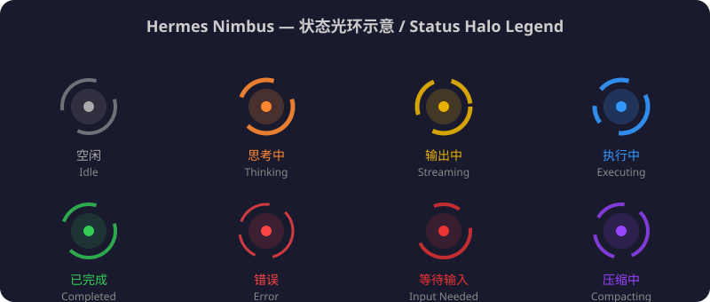

# Hermes Nimbus

> **Nimbus** — 神祇身后的灵光晕轮，实时映照 Hermes Agent 的每一次脉动。
> **Nimbus** — The luminous halo behind the divine, reflecting every pulse of your Hermes Agents in real time.

[](LICENSE)

<div align="center">
  
</div>

---

## 📖 中文

**Hermes Nimbus** 是一款实时显示多个 [Hermes Agent](https://github.com/NousResearch/hermes-agent) 运行状态的光环指示器仪表盘。它通过监控每个 Agent 实例的日志和状态数据库，以流畅的 Canvas 动画光环直观展示每个个体的当前状态。

### ✨ 功能特性

- 🎨 **多实例监控** — 同时监控多个 Hermes 个体（Profile）
- 🔄 **实时更新** — 基于日志 + state.db 双源检测，500ms 刷新
- 🤖 **自动发现** — 启动时自动扫描 `~/.hermes/profiles/`，无需手动配置
- ✨ **流畅动画** — Canvas 绘制不规则圆环光环动画，8 种状态各有独特动效
- 📊 **首页概览** — 一眼查看所有个体状态
- 🔍 **实例详情** — 点击任意实例查看详细状态历史
- 🖥️ **全屏模式** — 支持全屏展示，适合大屏监控
- 📱 **响应式设计** — 完美适配桌面和移动设备
- 🩺 **健康检查** — HTTP API + WebSocket 实时推送

### 🎯 状态说明

| 状态 | 颜色 | 说明 |
|------|------|------|
| ⚪ 空闲 | 灰白 `#aaaaaa` | 正在等待任务 |
| 🟠 思考中 | 琥珀 `#ff8830` | 正在处理请求 |
| 💛 输出中 | 金色 `#e8b100` | 正在生成回复 |
| 🔵 执行中 | 蓝色 `#3399ff` | 正在调用工具 |
| 🔴 等待输入 | 红色 `#ee3333` | 需要用户确认 |
| 🟢 已完成 | 绿色 `#33cc55` | 任务已完成 |
| ❌ 错误 | 红色 `#ff4444` | 出现错误 |
| 🟣 压缩中 | 紫色 `#9944ff` | 正在整理上下文 |

### 🔧 快速开始

**前置条件：** Python 3.10+，aiohttp

```bash
pip install aiohttp

# 启动
cd hermes-nimbus
./scripts/start.sh

# 或直接运行
python3 scripts/halo_server.py --port 8765
```

**访问地址：**

| 地址 | 说明 |
|------|------|
| `http://localhost:8765` | 🏠 首页（多实例概览） |
| `http://localhost:8765/detail.html` | 🔍 实例详情页 |
| `http://localhost:8765/fullscreen.html` | 🖥️ 全屏模式 |
| `http://localhost:8765/api/health` | 🩺 健康检查 API |
| `ws://localhost:8765/ws` | 🔄 WebSocket 实时推送 |

**Systemd 用户服务（开机自启）：**

```bash
mkdir -p ~/.config/systemd/user/
cp hermes-nimbus.service ~/.config/systemd/user/
systemctl --user daemon-reload
systemctl --user enable --now hermes-nimbus.service
```

**环境变量：**

| 变量 | 说明 | 默认值 |
|------|------|--------|
| `HERMES_NIMBUS_CONFIG` | 配置文件路径 | `~/.hermes/hermes-nimbus/config.json` |
| `HERMES_HALO_PYTHON` | Python 解释器路径 | `python3` |

### 🤖 自动发现机制

从 v2 开始，Hermes Nimbus 支持自动发现 Hermes Profile。启动时会自动扫描：

```
~/.hermes/profiles/*/logs/agent.log
~/.hermes/profiles/*/state.db
```

扫描到有效 Profile 后自动写入配置文件并注册到仪表盘。如果你需要自定义配置，也可以手动编辑：

**配置文件路径：** `~/.hermes/hermes-nimbus/config.json`

```json
{
  "instances": [
    {
      "id": "my-agent",
      "name": "我的 Agent",
      "description": "自定义描述",
      "log_path": "~/.hermes/logs/agent.log",
      "db_path": "~/.hermes/state.db",
      "color": "#3399ff",
      "icon": "🤖"
    }
  ]
}
```

### 🔬 检测原理

三级检测确保状态判定的准确性：

1. **📝 日志实时监控** — 监听 `agent.log` 新增行，识别关键词（`OpenAI client created`、`tool_executor`、`Turn ended` 等）
2. **🗄️ 数据库查询** — 读取 `state.db` 中最新会话的消息角色和时间戳
3. **⚙️ 进程 CPU 检测** — 回退方案，通过 `ps` 检测对应进程的 CPU 使用率

### 📁 项目结构

```
hermes-nimbus/
├── README.md                     # 本文件
├── LICENSE                       # MIT License
├── config.example.json           # 配置文件示例
├── .gitignore
├── hermes-nimbus.service         # systemd 用户服务单元
├── requirements.txt              # Python 依赖
├── scripts/
│   ├── halo_server.py            # HTTP + WebSocket 同端口服务器
│   ├── hermes_state.py           # 多实例状态检测器（含自动发现）
│   └── start.sh / stop.sh / status.sh
├── static/
│   ├── index.html                # 首页（多实例概览）
│   ├── detail.html               # 实例详情页
│   ├── fullscreen.html           # 全屏展示
│   ├── halo-states.svg           # 状态示意图
│   └── favicon.svg               # 网站图标
```

### 🛠️ 管理命令

```bash
cd ~/hermes-nimbus

# 查看所有实例状态
python3 scripts/hermes_state.py --list

# 持续监控
python3 scripts/hermes_state.py --watch

# 调试模式
python3 scripts/hermes_state.py --debug

# 启动 / 停止 / 状态
./scripts/start.sh
./scripts/stop.sh
./scripts/status.sh
```

### 📡 API 接口

**HTTP：**
- `GET /api/health` — 服务健康与实例列表
- `GET /api/states` — 全部实例当前状态

**WebSocket 消息：**

| 方向 | 消息类型 | 说明 |
|------|---------|------|
| 📤 客户端 → 服务端 | `get_states` | 获取所有实例状态 |
| | `get_state {instance_id}` | 获取指定实例详情 |
| | `set_state {instance_id, state}` | 手动设置状态 |
| | `ping` | 心跳检测 |
| 📥 服务端 → 客户端 | `states_update` | 全量状态更新（自动推送） |
| | `state_update` | 单个实例状态更新 |
| | `pong` | 心跳响应 |
| | `error` | 错误消息 |

### 🙏 致谢

- [Claude Halo](https://github.com/Houyusu/claude-halo) — 本项目灵感来源，致敬 Claude Halo 的优雅光环动画
- [Hermes Agent](https://github.com/NousResearch/hermes-agent) — 目标监控应用

### 📄 许可证

MIT License

---

## 📖 English

**Hermes Nimbus** is a real-time status halo dashboard for [Hermes Agent](https://github.com/NousResearch/hermes-agent) instances. It monitors each agent's log files and state database, displaying their current status through fluid Canvas-animated glowing halos.

### ✨ Features

- 🎨 **Multi-instance monitoring** — Watch multiple Hermes profiles simultaneously
- 🔄 **Real-time updates** — Dual-source detection via logs + state.db, 500ms refresh
- 🤖 **Auto-discovery** — Automatically scans `~/.hermes/profiles/` on startup
- ✨ **Fluid animations** — Canvas-drawn irregular halos, 8 unique status animations
- 📊 **Dashboard overview** — See all agent status at a glance
- 🔍 **Instance details** — Click any instance for detailed status history
- 🖥️ **Fullscreen mode** — Perfect for wall-mounted monitoring
- 📱 **Responsive** — Works on desktop and mobile
- 🩺 **Health check** — HTTP API + WebSocket push

### 🎯 Status Legend

| Status | Color | Description |
|--------|-------|-------------|
| ⚪ Idle | Gray `#aaaaaa` | Waiting for tasks |
| 🟠 Thinking | Amber `#ff8830` | Processing a request |
| 💛 Streaming | Gold `#e8b100` | Generating response |
| 🔵 Executing | Blue `#3399ff` | Calling tools |
| 🔴 Input Needed | Red `#ee3333` | Awaiting user input |
| 🟢 Completed | Green `#33cc55` | Task finished |
| ❌ Error | Red `#ff4444` | An error occurred |
| 🟣 Compacting | Purple `#9944ff` | Compressing context |

### 🔧 Quick Start

```bash
pip install aiohttp

cd hermes-nimbus
./scripts/start.sh
# Open http://localhost:8765
```

### 🤖 Auto-Discovery

Since v2.0.0, Hermes Nimbus automatically discovers Hermes profiles by scanning `~/.hermes/profiles/` for valid log files and state databases. No manual configuration needed for standard setups.

### 🔬 Detection Pipeline

1. **📝 Real-time log monitoring** — Watches `agent.log` for keywords
2. **🗄️ Database query** — Reads `state.db` session data
3. **⚙️ Process CPU check** — Falls back to `ps` CPU monitoring

### 🙏 Credits

- [Claude Halo](https://github.com/Houyusu/claude-halo) — Inspired by Claude Halo's elegant glow animations
- [Hermes Agent](https://github.com/NousResearch/hermes-agent) — The target application being monitored

### 📄 License

MIT License
